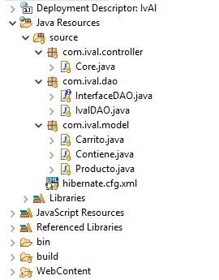
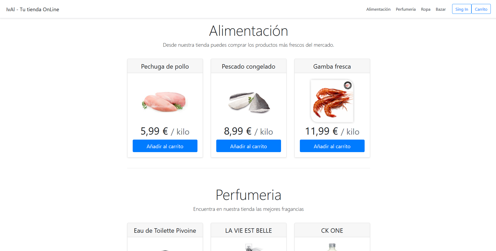

# IvAl - Marketplace
New project in collab with <a href="https://github.com/ivanperezmolina" target="_blank">Iván Pérez Molina</a> <br>
IvAl is our brand new Marketplace test project. We are usign the following technologies: <br>
<ul>
    <li>MySQL</li>
    <li>Java Servlet</li>
    <li>Hibernate Framework</li>
    <li>AJAX Requests</li>
    <li>More... (we will update this list, i promiss)</li>
</ul>
<h1>Starting our project: role assignment </h1>
<a href="https://github.com/ivanperezmolina" target="_blank">Iván Pérez Molina</a> Is going to develop the FrontEnd <br>
<a href="https://github.com/proyectos-Albertogomp" target="_blank">Alberto Gómez Peña</a> Is going to develope the Backend <br> (Alberto is using two Github accounts, one is going to be used at home and the other at the office)
<h1>First things first... Our Database:</h1>
We have designed it using <a href="https://erdplus.com" target="_blank">ERDPlus</a> for the E/R Diagram and Relational Schema, as following:

And it generated from the Relational Schema, this SQL Query (which we edited):

```SQL
CREATE TABLE Producto
(
  CodPro INT NOT NULL AUTO_INCREMENT,
  NomPro VARCHAR(50) NOT NULL,
  DescPro VARCHAR(100),
  PrePro FLOAT NOT NULL ,
  StockPro INT NOT NULL,
  PRIMARY KEY (CodPro)
);

CREATE TABLE Carrito
(
  CodCar INT NOT NULL AUTO_INCREMENT,
  FechCar DATE NOT NULL,
  TotCar FLOAT NOT NULL,  
  PRIMARY KEY (CodCar)
);

CREATE TABLE Contiene
(
  CodPro INT NOT NULL,
  CodCar INT NOT NULL,
  PRIMARY KEY (CodPro, CodCar),
  FOREIGN KEY (CodPro) REFERENCES Producto(CodPro),
  FOREIGN KEY (CodCar) REFERENCES Carrito(CodCar)
);
CREATE TABLE SecureLogin (
  user varchar(20) NOT NULL,
  password char(156)  NOT NULL,
  condimento char(11)  NOT NULL,
  PRIMARY KEY (user)
)

```

<h1>Let's build!: Creating the Eclipse project</h1>
Okay... things are getting serious. We have already create the project, imported some hibernate libs and created classes and config file.
<h1> Control time: DAO, servlet, hibernate.... </h1>
Hibernate is configured, DAO is created, corrected and given an interface. Servlet is created with some functions and prepared for the "action"s functions. Our project looks as follows:<br>

<h2>Key fact: Security</h2>
We know that keeping user credentials is crucial, and we have ensured that our project is as secure as we can and we have implemented a password salting method:<br>

```java
	  public static String generateStorngPasswordHash(String password,String SaltStr) throws NoSuchAlgorithmException, InvalidKeySpecException
	    {
	        int iterations = 1000;
	        char[] chars = password.toCharArray();
	        byte[] salt = SaltStr.getBytes();
	         
	        PBEKeySpec spec = new PBEKeySpec(chars, salt, iterations, 64 * 8);
	        SecretKeyFactory skf = SecretKeyFactory.getInstance("PBKDF2WithHmacSHA1");
	        byte[] hash = skf.generateSecret(spec).getEncoded();
	        return iterations + ":" + toHex(salt) + ":" + toHex(hash);
	    }
```
This method gets the user's password and gets a salt. It gets mixed and secured with SHA1 and stored localy in a String. Our salt is generated this way: <br>

```java
 public static byte[] getSalt() throws NoSuchAlgorithmException
	    {
	        SecureRandom sr = SecureRandom.getInstance("SHA1PRNG");
	        byte[] salt = new byte[16];
	        sr.nextBytes(salt);
	        return salt;
	    }
```
This functions generates for every user's password a byte array with random characteres. In case of being hacked, all passwords are secure in our database, because it's imposible to get an user password without it (even if we both have the salt and the secure password) <br>

Of course, we also need to check at login the user's password inserted and stored, we just use this:

```java
public static boolean validatePassword(String originalPassword, String storedPassword) throws NoSuchAlgorithmException, InvalidKeySpecException
	    {
	        String[] parts = storedPassword.split(":");
	        int iterations = Integer.parseInt(parts[0]);
	        byte[] salt = fromHex(parts[1]);
	        byte[] hash = fromHex(parts[2]);
	         
	        PBEKeySpec spec = new PBEKeySpec(originalPassword.toCharArray(), salt, iterations, hash.length * 8);
	        SecretKeyFactory skf = SecretKeyFactory.getInstance("PBKDF2WithHmacSHA1");
	        byte[] testHash = skf.generateSecret(spec).getEncoded();
	         
	        int diff = hash.length ^ testHash.length;
	        for(int i = 0; i < hash.length && i < testHash.length; i++)
	        {
	            diff |= hash[i] ^ testHash[i];
	        }
	        return diff == 0;
	    }
```
this way, the password is just "unsafe" until reaching these functions, the server-side is safe, but we have to also secure the client-side (we will talk about this later)<br>

<h1>Let's see!: Creating the main view (static)</h1>
Now we have a template of our marketplace. We are now focused on the back-frontend join and doing some connection tests.<br>

