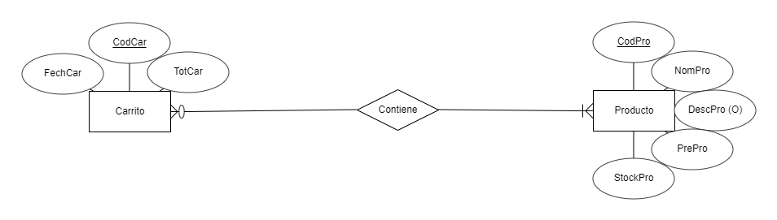

# IvAl - Marketplace
New project in collab with <a href="https://github.com/ivanperezmolina" target="_blank">Iván Pérez Molina</a> <br>
IvAl is our brand new Marketplace test project. We are usign the following technologies: <br>
<ul>
    <li>MySQL</li>
    <li>Java Servlet</li>
    <li>Hibernate Framework</li>
    <li>AJAX Requests</li>
    <li>More... (we will update this list, i promiss)</li>
</ul>
<h1>Starting our project: role assignment </h1>
<a href="https://github.com/ivanperezmolina" target="_blank">Iván Pérez Molina</a> Is going to develop the FrontEnd <br>
<a href="https://github.com/proyectos-Albertogomp" target="_blank">Alberto Gómez Peña</a> Is going to develope the Backend <br> (Alberto is using two Github accounts, one is going to be used at home and the other at the office)
<h1>First things first... Our Database:</h1>
We have designed it using <a href="https://erdplus.com" target="_blank">ERDPlus</a> for the E/R Diagram and Relational Schema, as following:

And it generated from the Relational Schema, this SQL Query (which we edited):

```SQL
CREATE TABLE Producto
(
  CodPro INT NOT NULL AUTO_INCREMENT,
  NomPro VARCHAR(50) NOT NULL,
  DescPro VARCHAR(100),
  PrePro FLOAT NOT NULL ,
  StockPro INT NOT NULL,
  PRIMARY KEY (CodPro)
);

CREATE TABLE Carrito
(
  CodCar INT NOT NULL AUTO_INCREMENT,
  FechCar DATE NOT NULL,
  TotCar FLOAT NOT NULL,  
  PRIMARY KEY (CodCar)
);

CREATE TABLE Contiene
(
  CodPro INT NOT NULL,
  CodCar INT NOT NULL,
  PRIMARY KEY (CodPro, CodCar),
  FOREIGN KEY (CodPro) REFERENCES Producto(CodPro),
  FOREIGN KEY (CodCar) REFERENCES Carrito(CodCar)
);
CREATE TABLE SecureLogin (
  user varchar(20) NOT NULL,
  password char(156)  NOT NULL,
  condimento char(11)  NOT NULL,
  PRIMARY KEY (user)
)

```

<h1>Let's build!: Creating the Eclipse project</h1>
Okay... things are getting serious. We have already create the project, imported some hibernate libs and created classes and config file.
<h1> Control time: DAO, servlet, hibernate.... </h1>
Hibernate is configured, DAO is created, corrected and given an interface. Servlet is created with some functions and prepared for the "action"s functions. Our project looks as follows:<br>

<h2>Key fact: Security</h2>
We know that keeping users' credentials secured is crucial, and we have ensured that our project is as secure as we can and we have implemented a password salting method:<br>

```java
	  public static String generateStorngPasswordHash(String password,String SaltStr) 
	  	throws NoSuchAlgorithmException, InvalidKeySpecException
	    {
	        int iterations = 1000;
	        char[] chars = password.toCharArray();
	        byte[] salt = SaltStr.getBytes();
	         
	        PBEKeySpec spec = new PBEKeySpec(chars, salt, iterations, 64 * 8);
	        SecretKeyFactory skf = SecretKeyFactory.getInstance("PBKDF2WithHmacSHA1");
	        byte[] hash = skf.generateSecret(spec).getEncoded();
	        return iterations + ":" + toHex(salt) + ":" + toHex(hash);
	    }
```
This method gets the user's password and gets a salt. It gets mixed and secured with SHA1 and stored localy in a String. Our salt is generated this way: <br>

```java
 public static byte[] getSalt() throws NoSuchAlgorithmException
	    {
	        SecureRandom sr = SecureRandom.getInstance("SHA1PRNG");
	        byte[] salt = new byte[16];
	        sr.nextBytes(salt);
	        return salt;
	    }
```
This functions generates for every user's password a byte array with random characteres. In case of being hacked, all passwords are secure in our database, because it's imposible to get an user password without it (even if we both have the salt and the secure password) <br>

Of course, we also need to check at login the user's password inserted and stored, we just use this:

```java
public static boolean validatePassword(String originalPassword, String storedPassword) 
	throws NoSuchAlgorithmException, InvalidKeySpecException
	    {
	        String[] parts = storedPassword.split(":");
	        int iterations = Integer.parseInt(parts[0]);
	        byte[] salt = fromHex(parts[1]);
	        byte[] hash = fromHex(parts[2]);
	         
	        PBEKeySpec spec = new PBEKeySpec(originalPassword.toCharArray(), salt, iterations, hash.length * 8);
	        SecretKeyFactory skf = SecretKeyFactory.getInstance("PBKDF2WithHmacSHA1");
	        byte[] testHash = skf.generateSecret(spec).getEncoded();
	         
	        int diff = hash.length ^ testHash.length;
	        for(int i = 0; i < hash.length && i < testHash.length; i++)
	        {
	            diff |= hash[i] ^ testHash[i];
	        }
	        return diff == 0;
	    }
```
this way, the password is just "unsafe" until reaching these functions, the server-side is safe, but we have to also secure the client-side (we will talk about this later)<br>

<h1>Let's see!: Creating the main view (static)</h1>
Now we have a template of our marketplace. We are now focused on the back-frontend join and doing some connection tests.<br>


<h2>Wait a second: Database values</h2>

Before anything else, we need to deploy some data, just for testing propourses (is this way written?, nevermind...) here they are: <br>
```SQL
INSERT INTO `producto` (`CodPro`, `NomPro`, `DescPro`, `PrePro`, `StockPro`) VALUES
(1, 'Pechuga de pollo', 'Filetes de pechuga de pollo de corral 450 gr', 5.99, 100),
(2, 'Pescado congeldado', 'Lomos de bacalao de la especie más apreciada, la Gadus morhua, de excelente sabor y delicada textura', 8.99, 100),
(3, 'Gamba fresca', 'Origen: (crudo o cocido)\r\nCategoría: Gamba Blanca de Huelva a Domicilio (Parapenaeus longirostris)', 11.99, 100),
(4, 'Eau de Toilette Pivoine', 'Una fragancia donde las notas verdes dan lugar poco a poco a un aroma floral y dulce.', 15.99, 100),
(5, 'LA VIE EST BELLE', 'El perfume La Vie est Belle de Lancôme es una declaración universal del derecho a la felicidad', 87.99, 100),
(6, 'CK ONE', 'CK One es una fragancia con un espíritu libre y joven que inspira a ser uno mismo.', 34.85, 100),
(7, 'Camisa de Hombre', 'Material exterior: 100% algodón\r\nCuidados: Lavar a máquina a 40 °C\r\nCuello: Con botones', 30.7, 50),
(8, 'Conjunto para bebe', 'Informal y encantador: en el conjunto para bebé, los más pequeños serán las estrellas', 17.99, 50),
(9, 'Camiseta para mujer', 'ALTA CALIDAD. Camiseta en punto flameado de lino con cuello redondo, mangas cortas y bajo recto.', 9.99, 50),
(10, 'Juego de herramientas', 'HERRAMIENTAS DE FABRICACIÓN PROFESIONAL: los kits de herramientas están fabricados con acero de alta', 22.76, 25),
(11, 'Aspiradora de mano', 'Es un modelo muy ligero. Como pesa poco más de un kilo, lo podrás llevar de un sitio para otro', 19.89, 25),
(12, 'Cafetera Cecotec', 'El café es parte fundamental de la sociedad actual, donde se consume como desayuno', 30.99, 25),
(13, 'Chuleton de ternera', 'Nuestro Chuletón de Ternera 500 g de Ávila procede de ganado vacuno de raza avileña.', 10.99, 100),
(14, 'JOHNSON\'S Colonia suave para bebé - 750ml', 'Testada dermatológicamente, es baja en alcohol, por lo que es suave para la piel de nuestro bebé', 3.99, 50),
(15, 'Pantalon Escalada Turia Jean Snow Hombre', 'Pantalón de cinco bolsillos en sarga lavada ligeramente elástica con cintura estándar', 39.95, 50),
(16, 'Tumbona de Aluminio - FLORABEST', 'Bastidor de aluminio de alta calidad, superficie resistente y de secado rápido. Ademas, es Plegable ', 34.95, 25);

```

<h1>First contact: Testing backend-frontend connection</h1>
We have just created a javascript function to request the servlet a <div> from other .jsp, this is what we get when we press the button:<br>


This is done thanks to this script:<br>

```javascript
function callJqueryAjax(action){
	  //var action = $('#name').val();
	  $.ajax(
	    {
	      url     : '/IvAl/Core',
	      method     : 'POST',
	      data     : {action: action},
	      success    : function(resultText){ $('#resultServlet').html(resultText); },
	      error : function(jqXHR, exception){
	        console.log('Error occured!!');
	      }
	    }
	    );
	  };
```

Where var action is initialized in the button with the param 'testconection'.
